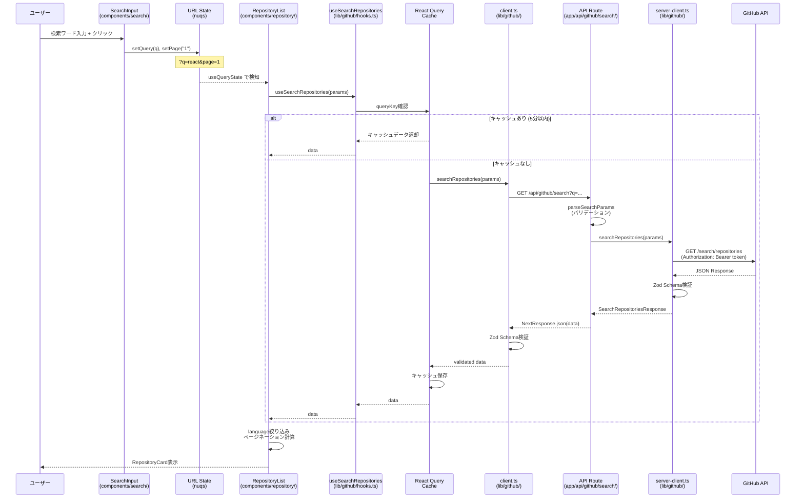
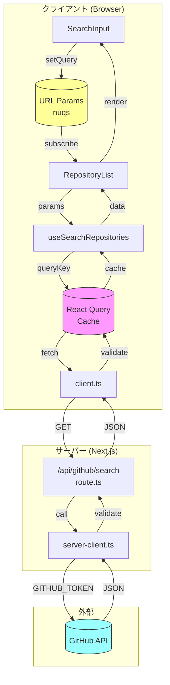
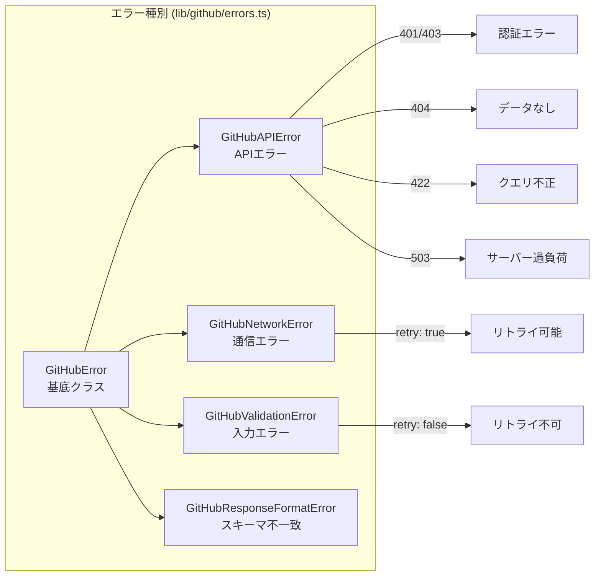

# API Flow

ユーザーがクリックしてからレスポンスが表示されるまでの流れ。

## シーケンス図

## コンポーネント図

## エラーハンドリングフロー

## 主要ファイル一覧

| レイヤー | ファイル                                    | 役割                      |
| -------- | ------------------------------------------- | ------------------------- |
| UI       | `components/search/search-input.tsx`        | 検索フォーム              |
| UI       | `components/repository/repository-list.tsx` | 結果一覧                  |
| Hooks    | `lib/github/hooks.ts`                       | React Query ラッパー      |
| Client   | `lib/github/client.ts`                      | クライアント側API呼び出し |
| Route    | `app/api/github/search/route.ts`            | APIエンドポイント         |
| Server   | `lib/github/server-client.ts`               | GitHub API呼び出し        |
| Types    | `lib/github/types.ts`                       | Zodスキーマ・型定義       |
| Errors   | `lib/github/errors.ts`                      | エラー型・ハンドリング    |
